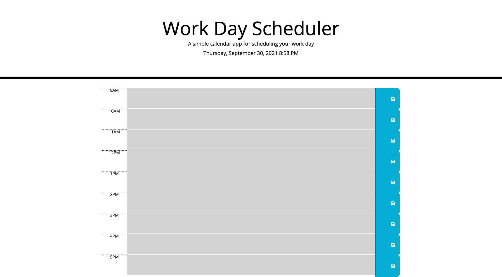

# Work Day Planner | HTML, CSS & jQuery 

## Description
Create a simple calendar application that allows a user to save events for each hour of the day by modifying starter code. This app will run in the browser and feature dynamically updated HTML and CSS powered by jQuery.

- When the user first visited the site, a current day and time is shown on the top of the calendar
- The planner is scheduled from 9am to 5pm 
- The user can fill out events/data at the text blocks with a related time period
- If the current time is before the timeblock time, then the block is shown in green 
- If the current time is the timeblock time, then it is shown in red 
- If the current time is after the blocktime, then the block is in grey 
- If the user clicked save button for the timeblock, the text for that event is saved in local storage
- If the user refresh the page, the saved events persist 

## Screenshot of the planner

## Deployed link to the app

https://elenaliu0415.github.io/work-day-planner/